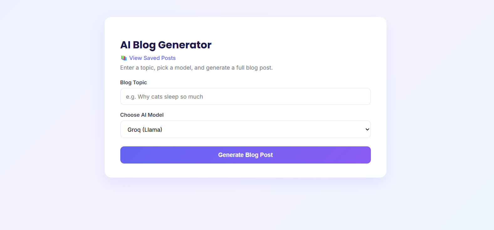
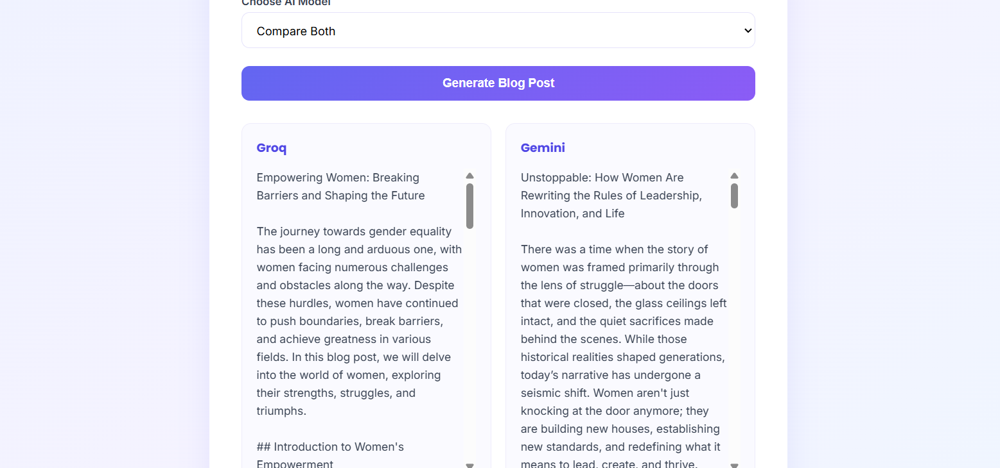
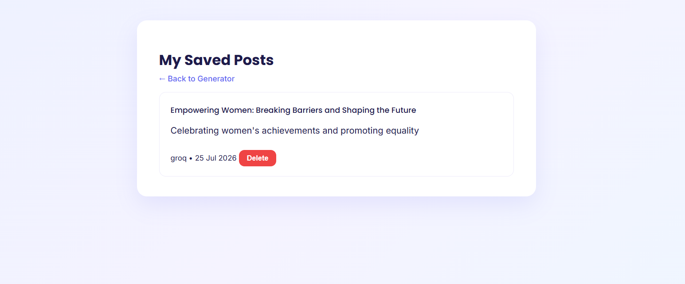

# BlogForge AI

An AI-powered blog post generator built with Flask. Pick a topic, choose an AI model, and get a full, structured blog post — complete with an SEO-friendly title, meta description, tags, and formatted body. Supports generating from multiple LLM providers and comparing their outputs side by side.

## Screenshots

### Blog Generator


### Compare Mode


### Saved Posts Dashboard


## Features

- **Multi-provider AI generation** — generate blog posts using Groq (Llama) or Gemini
- **Compare mode** — generate from both providers in parallel and compare the results side by side
- **Structured output** — every post comes back with a title, meta description, tags, and a well-organized markdown body (intro, sections, key  takeaways, sources)
- **Save & manage posts** — save any generated post to a database and revisit it later
- **Dashboard** — view, open, and delete all saved posts from one place
- **Clean, responsive UI** — works on desktop and mobile

## Tech Stack

- **Backend:** Flask (Python)
- **Database:** SQLite via Flask-SQLAlchemy
- **AI Providers:** Groq (Llama models), Google Gemini
- **Data validation:** Pydantic
- **Frontend:** HTML, CSS, vanilla JavaScript (no framework)

## Project Structure

\```
blog_ai/
├── app.py                     # Flask app entry point
├── models.py                  # Database model (Post)
├── requirements.txt
├── .env                       # API keys (not committed)
│
├── routes/
│   ├── generate.py            # /generate_blog, /compare_blog
│   └── posts.py                # /save_post, /dashboard, /posts/<id>
│
├── services/
│   ├── model_provider.py      # Routes requests to the selected AI provider
│   ├── groq_client.py
│   ├── gemini_client.py
│   ├── prompts.py             # Prompt templates
│   └── response_model.py      # Structured response parsing (BlogPost)
│
├── templates/
│   ├── index.html             # Generator page
│   ├── dashboard.html         # Saved posts list
│   └── post_view.html         # Single saved post
│
├── screenshots/               # Images used in this README
│
└── static/
    ├── css/style.css
    └── js/generator.js
\```

## Setup

### 1. Clone the repository

\```bash
git clone https://github.com/simran35-wtf/BlogForge-AI.git
cd BlogForge-AI
\```

### 2. Install dependencies

\```bash
pip install -r requirements.txt
\```

### 3. Add your API keys

Create a `.env` file in the project root:

\```
GROQ_API_KEY=your_groq_key_here
GEMINI_API_KEY=your_gemini_key_here
SECRET_KEY=any_random_string
\```

- Get a free Groq key: [console.groq.com/keys](https://console.groq.com/keys)
- Get a free Gemini key: [aistudio.google.com/apikey](https://aistudio.google.com/apikey)

### 4. Run the app

\```bash
python app.py
\```

Open [http://127.0.0.1:5000](http://127.0.0.1:5000) in your browser.

## How It Works

1. Enter a topic and choose a model (Groq, Gemini, or Compare Both)
2. The backend builds a structured prompt and sends it to the selected AI provider
3. The AI's response is parsed into a clean structure — title, meta description, tags, and body
4. The result is displayed instantly; you can save it to the dashboard for later

## Roadmap

- [ ] Add more providers (OpenAI, Claude) once available
- [ ] Word count / tone / length controls
- [ ] Export posts as Markdown or PDF
- [ ] Deploy to a live hosting platform

## License

This project is open source and available for learning and personal use.